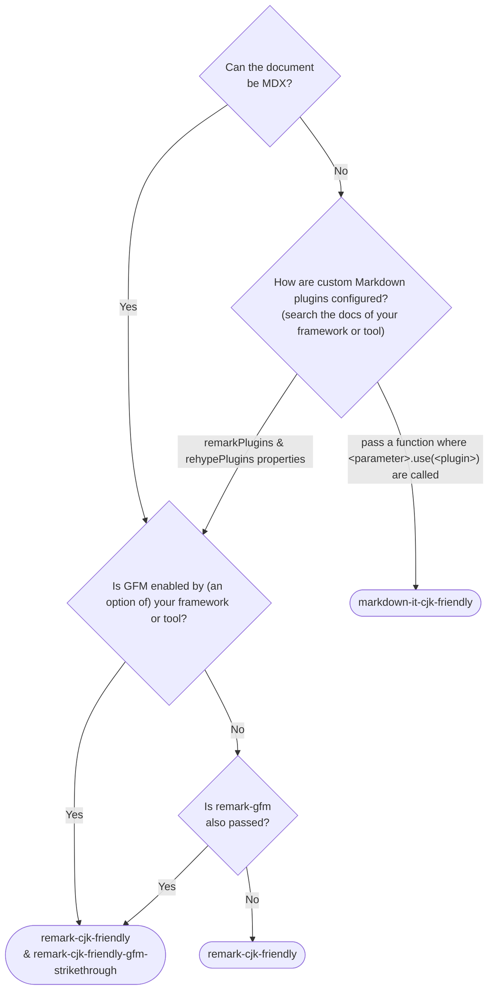

# Markdown packages in CommonMark revision candidate compatible with Chinese, Japanese, and Korean (CJK)

> [English](./README.md) | **日本語** | [한국어](./README.ko.md) | [简体中文](./README.zh-Hans.md)


## パッケージ一覧

- [`markdown-it-cjk-friendly`](./packages/markdown-it-cjk-friendly) [](https://npmjs.com/package/markdown-it-cjk-friendly)  [](https://npmjs.com/package/markdown-it-cjk-friendly) [](https://npmjs.com/package/markdown-it-cjk-friendly)
- [`remark-cjk-friendly`](./packages/remark-cjk-friendly) [](https://npmjs.com/package/remark-cjk-friendly) 
 [](https://npmjs.com/package/remark-cjk-friendly) [](https://npmjs.com/package/remark-cjk-friendly)
  - [`remark-cjk-friendly-gfm-strikethrough`](./packages/remark-cjk-friendly-gfm-strikethrough) [](https://npmjs.com/package/remark-cjk-friendly-gfm-strikethrough)  [](https://npmjs.com/package/remark-cjk-friendly-gfm-strikethrough) [](https://npmjs.com/package/remark-cjk-friendly-gfm-strikethrough)
  - [`micromark-extension-cjk-friendly`](./packages/micromark-extension-cjk-friendly) [](https://npmjs.com/package/micromark-extension-cjk-friendly)  [](https://npmjs.com/package/micromark-extension-cjk-friendly) [](https://npmjs.com/package/micromark-extension-cjk-friendly)
    - [`micromark-extension-cjk-friendly-util`](./packages/micromark-extension-cjk-friendly-util) [](https://npmjs.com/package/micromark-extension-cjk-friendly-util)  [](https://npmjs.com/package/micromark-extension-cjk-friendly-util) [](https://npmjs.com/package/micromark-extension-cjk-friendly-util)
    - [`micromark-extension-cjk-friendly-gfm-strikethrough`](./packages/micromark-extension-cjk-friendly-gfm-strikethrough) [](https://npmjs.com/package/micromark-extension-cjk-friendly-gfm-strikethrough)  [](https://npmjs.com/package/micromark-extension-cjk-friendly-gfm-strikethrough) [](https://npmjs.com/package/micromark-extension-cjk-friendly-gfm-strikethrough)
- ~~[`markdown-it-cj-friendly`](./packages/markdown-it-cj-friendly)~~ [](https://npmjs.com/package/markdown-it-cj-friendly) [](https://npmjs.com/package/markdown-it-cj-friendly) (Deprecated; switch to `markdown-it-cjk-friendly`)

## 移植

### 拡張機能として

- [Comrak](https://github.com/kivikakk/comrak)
  - [commonmarker](https://github.com/gjtorikian/commonmarker)

## 予定

- Tweak specifications
- Port for non-JavaScript implementations

## 規格書

[specification.md](specification.md)（英語） を参照してください。

### 実装者向け文書

- [implementers-tips.md](implementers-tips.md) (English)
- [ranges.md](ranges.md) (English)

## 問題

CommonMarkには、日本語・中国語・韓国語内の次のような強調記号(`**`)が強調記号として認識されない問題があります。

```md
**このアスタリスクは強調記号として認識されず、そのまま表示されます。**この文のせいで。

**该星号不会被识别，而是直接显示。**这是因为它没有被识别为强调符号。

**이 별표는 강조 표시로 인식되지 않고 그대로 표시됩니다(이 괄호 때문에)**이 문장 때문에.
```

これが起こった原因は、終了側の`**`のすぐ内側が約物（。やカッコ）、かつ外側が約物や空白以外の文字であるためです。

もちろん終了側だけでなく、開始側も同様の問題が存在します。

CommonMark issue: https://github.com/commonmark/commonmark-spec/issues/650

## 元のCommonMarkやGFMの代わりにこの仕様を採用べき人

もしエンジニアであるあなたが全てに監修を入れられない日本語・中国語・韓国語のコンテンツを扱わなければならない場合、素のCommonMarkやGFMではなく、この仕様を採用することを強く推奨します。「全てに監修を入れられない」というのは、例えば次のようなものを指します。

1. ユーザまたはAIが作成したコンテンツをそのまま表示する必要がある場合。例えば：

    | ❌️ 素のCommonMark | ✅️ 本規格 |
    |---|---|
    | 这是一个\*\*“会引起”<b>渲染错误的</b>“已知问题”<b>，当加重符号\*\*遇到某些中文标点时，可能就会出现</b>“识别不了”\*\*的情况。就如这句话展现的一样。| 这是一个<b>“会引起”</b>渲染错误的<b>“已知问题”</b>，当加重符号\*\*遇到某些中文标点时，可能就会出现<b>“识别不了”</b>的情况。就如这句话展现的一样。 |

    来源: [CherryHQ/cherry-studio#4119](https://github.com/CherryHQ/cherry-studio/pull/4119)

2. 翻訳者に、このCommonMarkの仕様を理解していない人も多く、なおかつリアルタイムで本番同様の描画プレビューを提供できず、`<strong>`タグを許可していない場合
    - 翻訳にCrowdin・Transifexなどの翻訳サービスを使っている場合
    - 翻訳の品質に責任を負っている人が非エンジニアである、またはComonMarkのこの挙動を理解していない場合

また、あなたが主に日本人・中国人・韓国人のいずれかまたは全てを対象としたMarkdown関連のソフトウェアやサービスを作成する場合も、この仕様を採用することを強く推奨します。

### 1.の例（中国語）

❌️素のCommonMark:


✅️本規格:


Image source: [CherryHQ/cherry-studio#4119](https://github.com/CherryHQ/cherry-studio/pull/4119)

## CommonMarkとの互換性

本仕様は、日本語・中国語・韓国語・ごく一部の絵文字や記号以外の入力に対してはCommonMarkと同一です。上記のプラグイン/拡張パッケージは、CommonMark 0.31.2時点の全てのCommonMarkテストケースでMarkdown実装が同じHTMLを出力することを保証しています。

## 他言語との互換性

この仕様変更提案は、日本語・中国語・韓国語以外の言語には影響しません。アプリケーションやドキュメントに他言語の翻訳やコンテンツが含まれていても影響はありませんので、安心してパッケージをご利用ください。

## 設定例

### MDX (using `remark-cjk-friendly` family)

- [Docusaurus](./demos/docusaurus/docusaurus.config.js)
- [Astro](./demos/astro/astro.config.mjs)
- [Rspress](./demos/rspress/rspress.config.ts)

### `markdown-it` (using `markdown-it-cjk-friendly`)

- [VitePress (v1.x)](./demos/vitepress/.vitepress/config.mjs) (built-in and enabled by default since v2.0.0-alpha.12)

## どのパッケージを使うべきか

`remark`・`markdown-it`・`micromark`を直接使っている場合は、そのパッケージの名前から始まるパッケージを使ってください。

`remark`・`markdown-it`・`micromark`を直接は使っていないのでどのパッケージを使うべきか不明な場合は、下記のフローチャートを参考にしてください。



## 貢献

### Issue・PRの投稿

Issue・PRは英語か日本語で投稿してください。英語を推奨します。

### Build

This repository adopts [PNPM](https://pnpm.io/) as a package manager.

To build all packages, run:

```bash
pnpm i
node --run build
```

To run tests, run:

```bash
node --run test
```
