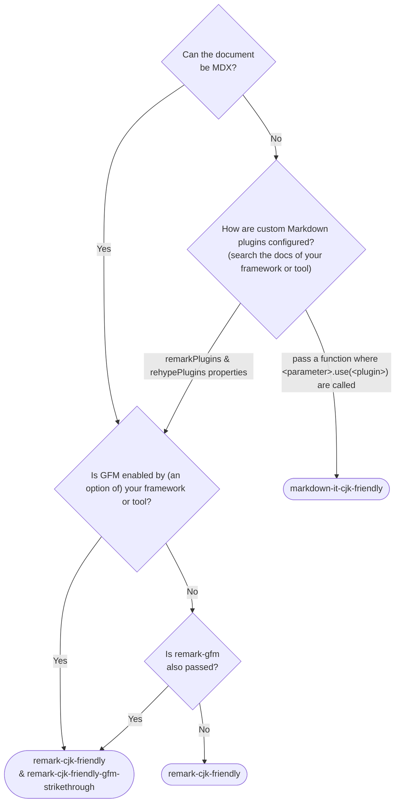

# Markdown packages in CommonMark revision candidate compatible with Chinese, Japanese, and Korean (CJK)

> [English](./README.md) | [日本語](./README.ja.md) | **한국어** | [简体中文](./README.zh-Hans.md)


## 패키지 목록

- [`markdown-it-cjk-friendly`](./packages/markdown-it-cjk-friendly) [](https://npmjs.com/package/markdown-it-cjk-friendly)  [](https://npmjs.com/package/markdown-it-cjk-friendly) [](https://npmjs.com/package/markdown-it-cjk-friendly)
- [`remark-cjk-friendly`](./packages/remark-cjk-friendly) [](https://npmjs.com/package/remark-cjk-friendly) 
 [](https://npmjs.com/package/remark-cjk-friendly) [](https://npmjs.com/package/remark-cjk-friendly)
  - [`remark-cjk-friendly-gfm-strikethrough`](./packages/remark-cjk-friendly-gfm-strikethrough) [](https://npmjs.com/package/remark-cjk-friendly-gfm-strikethrough)  [](https://npmjs.com/package/remark-cjk-friendly-gfm-strikethrough) [](https://npmjs.com/package/remark-cjk-friendly-gfm-strikethrough)
  - [`micromark-extension-cjk-friendly`](./packages/micromark-extension-cjk-friendly) [](https://npmjs.com/package/micromark-extension-cjk-friendly)  [](https://npmjs.com/package/micromark-extension-cjk-friendly) [](https://npmjs.com/package/micromark-extension-cjk-friendly)
    - [`micromark-extension-cjk-friendly-util`](./packages/micromark-extension-cjk-friendly-util) [](https://npmjs.com/package/micromark-extension-cjk-friendly-util)  [](https://npmjs.com/package/micromark-extension-cjk-friendly-util) [](https://npmjs.com/package/micromark-extension-cjk-friendly-util)
    - [`micromark-extension-cjk-friendly-gfm-strikethrough`](./packages/micromark-extension-cjk-friendly-gfm-strikethrough) [](https://npmjs.com/package/micromark-extension-cjk-friendly-gfm-strikethrough)  [](https://npmjs.com/package/micromark-extension-cjk-friendly-gfm-strikethrough) [](https://npmjs.com/package/micromark-extension-cjk-friendly-gfm-strikethrough)
- ~~[`markdown-it-cj-friendly`](./packages/markdown-it-cj-friendly)~~ [](https://npmjs.com/package/markdown-it-cj-friendly) [](https://npmjs.com/package/markdown-it-cj-friendly) (Deprecated; switch to `markdown-it-cjk-friendly`)

## 이식

### 패키지로 만들기

- [Comrak](https://github.com/kivikakk/comrak)
  - [commonmarker](https://github.com/gjtorikian/commonmarker)

## 예정

- Tweak specifications
- Port for non-JavaScript implementations

## 규정서

[specification.md](specification.md)（영어）를 참고해 주시기 바라요.

### 구현자를 위한 문서

- [implementers-tips.md](implementers-tips.md) (English)
- [ranges.md](ranges.md) (English)

## 문제점

CommonMark는 일본어와 중국어에서 다음과 같은 강조 표시 `**`가 강조 표시로 인식되지 않는 문제가 있습니다.

```md
**このアスタリスクは強調記号として認識されず、そのまま表示されます。**この文のせいで。

**该星号不会被识别，而是直接显示。**这是因为它没有被识别为强调符号。

**이 별표는 강조 표시로 인식되지 않고 그대로 표시됩니다(이 괄호 때문에)**이 문장 때문에.
```

이 문제는 `**` 바로 안쪽의 문자가 (일본어나 중국어) 문장 부호(。) 또는 괄호이고 바깥쪽 문자가 공백이나 문장 부호가 아니기 때문에 발생합니다.

물론 끝나는 부분뿐만 아니라 시작하는 부분에서도 동일한 문제가 있습니다.

CommonMark issue: https://github.com/commonmark/commonmark-spec/issues/650

## 누가 원래의 CommonMark나 GFM 대신 이 사양을 채택해야 하는가?

엔지니어로서 완전히 감독할 수 없는 한국어, 일본어, 중국어 콘텐츠를 다뤄야 하는 경우, 일반 CommonMark나 GFM 대신 이 사양을 채택할 것을 강력히 권장합니다. "완전히 감독할 수 없는"이란 다음과 같은 상황을 의미합니다:

1. 사용자 또는 AI가 생성한 콘텐츠를 그대로 표시해야 하는 경우. 예를 들어:

    | ❌️ 기본 CommonMark | ✅️ 이 사양을 채택하는 경우 |
    |---|---|
    | 这是一个\*\*“会引起”<b>渲染错误的</b>“已知问题”<b>，当加重符号\*\*遇到某些中文标点时，可能就会出现</b>“识别不了”\*\*的情况。就如这句话展现的一样。| 这是一个<b>“会引起”</b>渲染错误的<b>“已知问题”</b>，当加重符号\*\*遇到某些中文标点时，可能就会出现<b>“识别不了”</b>的情况。就如这句话展现的一样。 |

    来源: [CherryHQ/cherry-studio#4119](https://github.com/CherryHQ/cherry-studio/pull/4119)

2. 많은 번역자가 이 CommonMark 동작을 이해하지 못하고, 실시간으로 실제 환경과 유사한 렌더링 미리보기를 제공할 수 없으며, `<strong>` 태그가 허용되지 않는 경우
    - Crowdin이나 Transifex 같은 번역 서비스를 사용하는 경우
    - 번역 품질에 책임을 지는 사람이 엔지니어가 아니거나 이 CommonMark 동작을 이해하지 못하는 경우

또한, 주로 한국어, 일본어, 중국어 사용자(또는 모두)를 대상으로 하는 Markdown 관련 소프트웨어나 서비스를 만들고 있다면, 이 사양을 채택할 것을 강력히 권장합니다.

## CommonMark와의 호환성

본 사양은 한국어, 중국어, 일본어 및 (일부 이모티콘과 기호)를 제외한 모든 입력에 대해 CommonMark와 동일합니다. 앞서 언급된 플러그인/확장 패키지는 CommonMark 0.31.2 기준의 모든 CommonMark 테스트 케이스에서 동일한 HTML을 출력하는 Markdown 구현을 보장합니다.

## 다른 언어와의 호환성

이번 사양 변경 제안은 일본어, 중국어, 한국어 이외의 언어에는 영향을 미치지 않습니다. 애플리케이션이나 문서에 다른 언어의 번역이나 콘텐츠가 포함되어 있어도 영향을 받지 않으므로 안심하고 패키지를 사용하시기 바랍니다.

## 예제 새플

### MDX (using `remark-cjk-friendly` family)

- [Docusaurus](./demos/docusaurus/docusaurus.config.js)
- [Astro](./demos/astro/astro.config.mjs)
- [Rspress](./demos/rspress/rspress.config.ts)

### `markdown-it` (using `markdown-it-cjk-friendly`)

- [VitePress (v1.x)](./demos/vitepress/.vitepress/config.mjs) (built-in and enabled by default since v2.0.0-alpha.12)

## 쓰었는 패키지를 사용해야 하나

`remark`, `markdown-it`, `micromark`를 직접 사용하지 않아서 어떤 패키지를 사용해야 하나에는 그녀의 패키지를 사용해야 하나요.

`remark`, `markdown-it`, `micromark`를 직접 사용하지 않아서 어떤 패키지를 사용해야 할지 모르는 경우에는 아래의 순서도를 참고해 주시기 바랍니다.



## 기여

### 이슈 및 PR 제출

이슈나 PR은 영어 또는 일본어로 제출해 주시기 바랍니다. 영어를 권장합니다.

### Build

This repository adopts [PNPM](https://pnpm.io/) as a package manager.

To build all packages, run:

```bash
pnpm i
node --run build
```

To run tests, run:

```bash
node --run test
```
