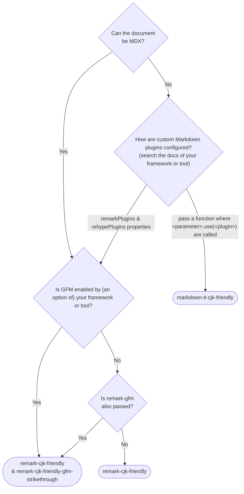

# Markdown packages in CommonMark revision candidate compatible with Chinese, Japanese, and Korean (CJK)

## Packages / <span lang="ja">パッケージ一覧</span> / <span lang="zh-Hans-CN">包裹</span> / <span lang="ko">패키지 목록</span>

- [`markdown-it-cjk-friendly`](./packages/markdown-it-cjk-friendly) [](https://npmjs.com/package/markdown-it-cjk-friendly)  [](https://npmjs.com/package/markdown-it-cjk-friendly) [](https://npmjs.com/package/markdown-it-cjk-friendly)
- [`remark-cjk-friendly`](./packages/remark-cjk-friendly) [](https://npmjs.com/package/remark-cjk-friendly) 
 [](https://npmjs.com/package/remark-cjk-friendly) [](https://npmjs.com/package/remark-cjk-friendly)
  - [`remark-cjk-friendly-gfm-strikethrough`](./packages/remark-cjk-friendly-gfm-strikethrough) [](https://npmjs.com/package/remark-cjk-friendly-gfm-strikethrough)  [](https://npmjs.com/package/remark-cjk-friendly-gfm-strikethrough) [](https://npmjs.com/package/remark-cjk-friendly-gfm-strikethrough)
  - [`micromark-extension-cjk-friendly`](./packages/micromark-extension-cjk-friendly) [](https://npmjs.com/package/micromark-extension-cjk-friendly)  [](https://npmjs.com/package/micromark-extension-cjk-friendly) [](https://npmjs.com/package/micromark-extension-cjk-friendly)
    - [`micromark-extension-cjk-friendly-util`](./packages/micromark-extension-cjk-friendly-util) [](https://npmjs.com/package/micromark-extension-cjk-friendly-util)  [](https://npmjs.com/package/micromark-extension-cjk-friendly-util) [](https://npmjs.com/package/micromark-extension-cjk-friendly-util)
    - [`micromark-extension-cjk-friendly-gfm-strikethrough`](./packages/micromark-extension-cjk-friendly-gfm-strikethrough) [](https://npmjs.com/package/micromark-extension-cjk-friendly-gfm-strikethrough)  [](https://npmjs.com/package/micromark-extension-cjk-friendly-gfm-strikethrough) [](https://npmjs.com/package/micromark-extension-cjk-friendly-gfm-strikethrough)
- ~~[`markdown-it-cj-friendly`](./packages/markdown-it-cj-friendly)~~ [](https://npmjs.com/package/markdown-it-cj-friendly) [](https://npmjs.com/package/markdown-it-cj-friendly) (Deprecated; switch to `markdown-it-cjk-friendly`)

## Ports / <span lang="ja">移植</span> / <span lang="zh-Hans-CN">移植</span> / <span lang="ko">이식</span>

### As an extension / <span lang="ja">拡張機能として</span> / <span lang="zh-Hans-CN">作为扩展</span> / <span lang="ko">패키지로 만들기</span>

- [Comrak](https://github.com/kivikakk/comrak)
  - [commonmarker](https://github.com/gjtorikian/commonmarker)

## Planned / <span lang="ja">予定</span> / <span lang="zh-Hans-CN">计划</span> / <span lang="ko">예정</span>

- Tweak specifications
- Port for non-JavaScript implementations

## Specification / <span lang="ja">規格書</span> / <span lang="zh-Hans-CN">规范</span> / <span lang="ko">규정서</span>

See [specification.md](specification.md).

<span lang="ja">[specification.md](specification.md)（英語） を参照してください。</span>

<span lang="zh-Hans-CN">参考 [specification.md](specification.md)（英文）。</span>

<span lang="ko">[specification.md](specification.md)（영어）를 참고해 주시기 바라요.</span>

### Documents for implementers / <span lang="ja">実装者向け文書</span> / <span lang="zh-Hans-CN">实施者文件</span> / <span lang="ko">구현자를 위한 문서</span>

- [implementers-tips.md](implementers-tips.md) (English)
- [ranges.md](ranges.md) (English)

## Problem / <span lang="ja">問題</span> / <span lang="zh-Hans-CN">问题</span> / <span lang="ko">문제점</span>

CommonMark has a problem that the following emphasis marks `**` are not recognized as emphasis marks in Japanese,Chinese, and Korean.

<span lang="ja">CommonMarkには、日本語・中国語・韓国語内の次のような強調記号(`**`)が強調記号として認識されない問題があります。</span>

<span lang="zh-Hans-CN">CommonMark存在以下问题：在中文、日语和韩语文本中，强调标记`**`不会被识别为强调标记。</span>

<span lang="ko">CommonMark는 일본어와 중국어에서 다음과 같은 강조 표시 `**`가 강조 표시로 인식되지 않는 문제가 있습니다.</span>

```md
**このアスタリスクは強調記号として認識されず、そのまま表示されます。**この文のせいで。

**该星号不会被识别，而是直接显示。**这是因为它没有被识别为强调符号。

**이 별표는 강조 표시로 인식되지 않고 그대로 표시됩니다(이 괄호 때문에)**이 문장 때문에.
```

This problem occurs because the character just inside the `**` is a (Japanese or Chinese) punctuation mark (。) or parenthesis and the character just outside is not a space or punctuation mark.

<span lang="ja">これが起こった原因は、終了側の`**`のすぐ内側が約物（。やカッコ）、かつ外側が約物や空白以外の文字であるためです。</span>

<span lang="zh-Hans-CN">这个问题是因为在`**`的结束部分，内侧字符是标点符号（。）或括号，而外侧字符不是空格或标点符号。</span>

<span lang="ko">이 문제는 `**` 바로 안쪽의 문자가 (일본어나 중국어) 문장 부호(。) 또는 괄호이고 바깥쪽 문자가 공백이나 문장 부호가 아니기 때문에 발생합니다.</span>

Of course, not only the end side but also the start side has the same issue.

<span lang="ja">もちろん終了側だけでなく、開始側も同様の問題が存在します。</span>

<span lang="zh-Hans-CN">当然，不仅是结束侧，开始侧也存在同样的问题。</span>

<span lang="ko">물론 끝나는 부분뿐만 아니라 시작하는 부분에서도 동일한 문제가 있습니다.</span>

CommonMark issue: https://github.com/commonmark/commonmark-spec/issues/650

## Who should adopt this specifications instead of the original CommonMark or GFM? / <span lang="ja">元のCommonMarkやGFMの代わりにこの仕様を採用べき人</span> / <span lang="zh-Hans-CN">谁应该采用这个规范而不是原始的CommonMark或GFM？</span> / <span lang="ko">누가 원래의 CommonMark나 GFM 대신 이 사양을 채택해야 하는가?</span>

If you are an engineer who must handle Chinese, Japanese, and Korean content that cannot be fully supervised, it is strongly recommended to adopt this specification instead of plain CommonMark or GFM. "Cannot be fully supervised" refers to situations such as:

1. When you need to display user-generated or AI-generated content as-is
2. When many translators do not understand this CommonMark behavior, and you cannot provide real-time rendering previews similar to production, and `<strong>` tags are not allowed
    - When using translation services like Crowdin or Transifex
    - When the person responsible for translation quality is not an engineer or does not understand this CommonMark behavior

Additionally, if you are creating Markdown-related software or services primarily targeting Chinese, Japanese, or Korean users (or all of them), it is strongly recommended to adopt this specification.

<span lang="ja">もしエンジニアであるあなたが全てに監修を入れられない日本語・中国語・韓国語のコンテンツを扱わなければならない場合、素のCommonMarkやGFMではなく、この仕様を採用することを強く推奨します。「全てに監修を入れられない」というのは、例えば次のようなものを指します。</span>

1. <span lang="ja">ユーザまたはAIが作成したコンテンツをそのまま表示する必要がある場合</span>
2. <span lang="ja">翻訳者に、このCommonMarkの仕様を理解していない人も多く、なおかつリアルタイムで本番同様の描画プレビューを提供できず、`<strong>`タグを許可していない場合</span>
    - <span lang="ja">翻訳にCrowdin・Transifexなどの翻訳サービスを使っている場合</span>
    - <span lang="ja">翻訳の品質に責任を負っている人が非エンジニアである、またはComonMarkのこの挙動を理解していない場合</span>

<span lang="ja">また、あなたが主に日本人・中国人・韓国人のいずれかまたは全てを対象としたMarkdown関連のソフトウェアやサービスを作成する場合も、この仕様を採用することを強く推奨します。</span>

<span lang="zh">如果作为工程师的您必须处理无法全面监督的中文、日文和韩文内容，强烈建议采用此规范，而不是普通的CommonMark或GFM。"无法全面监督"指的是以下情况：</span>

1. <span lang="zh">当需要按原样显示用户生成或AI生成的内容时</span>
2. <span lang="zh">当许多翻译人员不理解这个CommonMark行为，而且无法提供类似生产环境的实时渲染预览，并且不允许使用`<strong>`标签时</span>
    - <span lang="zh">当使用Crowdin或Transifex等翻译服务时</span>
    - <span lang="zh">当负责翻译质量的人不是工程师或不理解这个CommonMark行为时</span>

<span lang="zh">此外，如果您正在创建主要面向中国人、日本人或韩国人（或全部）的Markdown相关软件或服务，也强烈建议采用此规范。</span>

<span lang="ko">엔지니어로서 완전히 감독할 수 없는 한국어, 일본어, 중국어 콘텐츠를 다뤄야 하는 경우, 일반 CommonMark나 GFM 대신 이 사양을 채택할 것을 강력히 권장합니다. "완전히 감독할 수 없는"이란 다음과 같은 상황을 의미합니다:</span>

1. <span lang="ko">사용자 또는 AI가 생성한 콘텐츠를 그대로 표시해야 하는 경우</span>
2. <span lang="ko">많은 번역자가 이 CommonMark 동작을 이해하지 못하고, 실시간으로 실제 환경과 유사한 렌더링 미리보기를 제공할 수 없으며, `<strong>` 태그가 허용되지 않는 경우</span>
    - <span lang="ko">Crowdin이나 Transifex 같은 번역 서비스를 사용하는 경우</span>
    - <span lang="ko">번역 품질에 책임을 지는 사람이 엔지니어가 아니거나 이 CommonMark 동작을 이해하지 못하는 경우</span>

<span lang="ko">또한, 주로 한국어, 일본어, 중국어 사용자(또는 모두)를 대상으로 하는 Markdown 관련 소프트웨어나 서비스를 만들고 있다면, 이 사양을 채택할 것을 강력히 권장합니다.</span>

### Example of 1. (Chinese) / <span lang="ja">1.の例（中国語）</span> / <span lang="zh-Hans-CN">1.的例子</span> / <span lang="ko">1.의 예제(한국어)</span>:

❌️Plain CommonMark / <span lang="ja">素のCommonMark</span> / <span lang="zh-Hans-CN">原生CommonMark</span> / <span lang="ko">기본 CommonMark</span>:


✅️With this spec / <span lang="ja">本規格</span> / <span lang="zh-Hans-CN">这个规范</span> / <span lang="ko">이 사양을 채택하는 경우</span>:


Image source: [CherryHQ/cherry-studio#4119](https://github.com/CherryHQ/cherry-studio/pull/4119)

## Compatibility with CommonMark / <span lang="ja">CommonMarkとの互換性</span> / <span lang="zh-Hans-CN">与CommonMark的兼容性</span> / <span lang="ko">CommonMark와의 호환성</span>

This specification is identical to CommonMark for all input except Chinese, Japanese, Korean, and (some emojis and symbols). The aforementioned plugins/extension packages guarantee that their Markdown implementations output the same HTML for all CommonMark test cases as of CommonMark 0.31.2.

<span lang="ja">本仕様は、日本語・中国語・韓国語・ごく一部の絵文字や記号以外の入力に対してはCommonMarkと同一です。上記のプラグイン/拡張パッケージは、CommonMark 0.31.2時点の全てのCommonMarkテストケースでMarkdown実装が同じHTMLを出力することを保証しています。</span>

<span lang="zh-Hans-CN">除中文、日文、韩文和（少数表情符号和符号）之外的所有输入，本规范与CommonMark完全相同。上述插件/扩展包保证其Markdown实现在CommonMark 0.31.2的所有测试用例中输出相同的HTML。</span>

<span lang="ko">본 사양은 한국어, 중국어, 일본어 및 (일부 이모티콘과 기호)를 제외한 모든 입력에 대해 CommonMark와 동일합니다. 앞서 언급된 플러그인/확장 패키지는 CommonMark 0.31.2 기준의 모든 CommonMark 테스트 케이스에서 동일한 HTML을 출력하는 Markdown 구현을 보장합니다.</span>

## Compatibility with the other languages / <span lang="ja">他言語との互換性</span> / <span lang="zh-Hans-CN">与其他语言的兼容性</span> / <span lang="ko">다른 언어와의 호환성</span>

This modification of the specification does not affect the other languages than Chinese, Japanese, and Korean. Even if your application or document has translations or content in other languages, it will not be affected, so please feel free to use the packages.

<span lang="ja">この仕様変更提案は、日本語・中国語・韓国語以外の言語には影響しません。アプリケーションやドキュメントに他言語の翻訳やコンテンツが含まれていても影響はありませんので、安心してパッケージをご利用ください。</span>

<span lang="zh-Hans-CN">除中文、日文和韩文外，建议的规范变更不会影响其他语言。请放心使用该软件包，因为如果您的应用程序或文档包含其他语言的翻译或内容，也不会受到影响。</span>

<span lang="ko">이번 사양 변경 제안은 일본어, 중국어, 한국어 이외의 언어에는 영향을 미치지 않습니다. 애플리케이션이나 문서에 다른 언어의 번역이나 콘텐츠가 포함되어 있어도 영향을 받지 않으므로 안심하고 패키지를 사용하시기 바랍니다.</span>

## Example Configurations / <span lang="ja">設定例</span> / <span lang="zh-Hans-CN">示例配置</span> / <span lang="ko">예제 새플</span>

### MDX (using `remark-cjk-friendly` family)

- [Docusaurus](./demos/docusaurus/docusaurus.config.js)
- [Astro](./demos/astro/astro.config.mjs)
- [Rspress](./demos/rspress/rspress.config.ts)

### `markdown-it` (using `markdown-it-cjk-friendly`)

- [VitePress](./demos/vitepress/.vitepress/config.mjs)

## Which package(s) should I use? / <span lang="ja">どのパッケージを使うべきか</span> / <span lang="zh-Hans-CN">应该使用哪个包</span> / <span lang="ko">쓰었는 패키지를 사용해야 하나</span>

If you're using `remark`, `markdown-it`, or `micromark` directly, you should use the corresponding packages whose names start with the name of the package you're using.

<span lang="ja">`remark`・`markdown-it`・`micromark`を直接使っている場合は、そのパッケージの名前から始まるパッケージを使ってください。</span>

<span lang="zh-Hans-CN">如果您因为直接使用 `remark`、`markdown-it` 或 `micromark` 而不知道该使用哪个包，可以参考下面的流程图。</span>

<span lang="ko">`remark`, `markdown-it`, `micromark`를 직접 사용하지 않아서 어떤 패키지를 사용해야 하나에는 그녀의 패키지를 사용해야 하나요.</span>

If you don't know which package to use because you're not using `remark`, `markdown-it`, or `micromark` directly, you can follow the flowchart below.

<span lang="ja">`remark`・`markdown-it`・`micromark`を直接は使っていないのでどのパッケージを使うべきか不明な場合は、下記のフローチャートを参考にしてください。</span>

<span lang="zh-Hans-CN">如果您因为没有直接使用 `remark`、`markdown-it` 或 `micromark` 而不知道该使用哪个包，可以参考下面的流程图。</span>

<span lang="ko">`remark`, `markdown-it`, `micromark`를 직접 사용하지 않아서 어떤 패키지를 사용해야 할지 모르는 경우에는 아래의 순서도를 참고해 주시기 바랍니다.</span>



## Contributing / <span lang="ja">貢献</span> / <span lang="zh-Hans-CN">贡献</span> / <span lang="ko">기여</span>

### Submit an issue or PR / <span lang="ja">Issue・PRの投稿</span> / <span lang="zh-Hans-CN">提出一个 issue 或 PR</span> / <span lang="ko">이슈 및 PR 제출</span>

Please submit an issue or PR in English or Japanese. English is recommended.

<span lang="ja">Issue・PRは英語か日本語で投稿してください。英語を推奨します。</span>

<span lang="zh-Hans-CN">请用英语或日语提交问题或 PR。建议使用英语。</span>

<span lang="ko">이슈나 PR은 영어 또는 일본어로 제출해 주시기 바랍니다. 영어를 권장합니다.</span>

### Build

This repository adopts [PNPM](https://pnpm.io/) as a package manager.

To build all packages, run:

```bash
pnpm i
node --run build
```

To run tests, run:

```bash
node --run test
```
