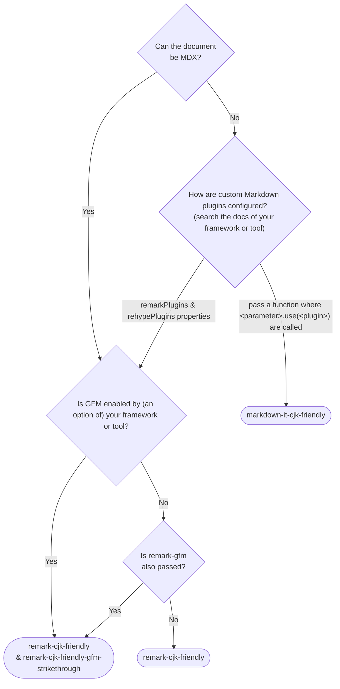

# Markdown packages in CommonMark revision candidate compatible with Chinese, Japanese, and Korean (CJK)

> [English](./README.md) | [日本語](./README.ja.md) | [한국어](./README.ko.md) | **简体中文**

## 相关的包

- [`markdown-it-cjk-friendly`](./packages/markdown-it-cjk-friendly) [](https://npmjs.com/package/markdown-it-cjk-friendly)  [](https://npmjs.com/package/markdown-it-cjk-friendly) [](https://npmjs.com/package/markdown-it-cjk-friendly)
- [`remark-cjk-friendly`](./packages/remark-cjk-friendly) [](https://npmjs.com/package/remark-cjk-friendly) 
 [](https://npmjs.com/package/remark-cjk-friendly) [](https://npmjs.com/package/remark-cjk-friendly)
  - [`remark-cjk-friendly-gfm-strikethrough`](./packages/remark-cjk-friendly-gfm-strikethrough) [](https://npmjs.com/package/remark-cjk-friendly-gfm-strikethrough)  [](https://npmjs.com/package/remark-cjk-friendly-gfm-strikethrough) [](https://npmjs.com/package/remark-cjk-friendly-gfm-strikethrough)
  - [`micromark-extension-cjk-friendly`](./packages/micromark-extension-cjk-friendly) [](https://npmjs.com/package/micromark-extension-cjk-friendly)  [](https://npmjs.com/package/micromark-extension-cjk-friendly) [](https://npmjs.com/package/micromark-extension-cjk-friendly)
    - [`micromark-extension-cjk-friendly-util`](./packages/micromark-extension-cjk-friendly-util) [](https://npmjs.com/package/micromark-extension-cjk-friendly-util)  [](https://npmjs.com/package/micromark-extension-cjk-friendly-util) [](https://npmjs.com/package/micromark-extension-cjk-friendly-util)
    - [`micromark-extension-cjk-friendly-gfm-strikethrough`](./packages/micromark-extension-cjk-friendly-gfm-strikethrough) [](https://npmjs.com/package/micromark-extension-cjk-friendly-gfm-strikethrough)  [](https://npmjs.com/package/micromark-extension-cjk-friendly-gfm-strikethrough) [](https://npmjs.com/package/micromark-extension-cjk-friendly-gfm-strikethrough)
- ~~[`markdown-it-cj-friendly`](./packages/markdown-it-cj-friendly)~~ [](https://npmjs.com/package/markdown-it-cj-friendly) [](https://npmjs.com/package/markdown-it-cj-friendly) (Deprecated; switch to `markdown-it-cjk-friendly`)

## 移植

### 作为扩展

- [Comrak](https://github.com/kivikakk/comrak)
  - [commonmarker](https://github.com/gjtorikian/commonmarker)

## 未来的改进

- Tweak specifications
- Port for non-JavaScript implementations

## 规范

参考 [specification.md](specification.md) (English)。

### 实现文档

- [implementers-tips.md](implementers-tips.md) (English)
- [ranges.md](ranges.md) (English)

## 问题

CommonMark存在以下问题：在中文、日语和韩语文本中，强调标记`**`不会被识别为强调标记。

```md
**このアスタリスクは強調記号として認識されず、そのまま表示されます。**この文のせいで。

**该星号不会被识别，而是直接显示。**这是因为它没有被识别为强调符号。

**이 별표는 강조 표시로 인식되지 않고 그대로 표시됩니다(이 괄호 때문에)**이 문장 때문에.
```

这个问题是因为在`**`的结束部分，内侧字符是标点符号（。）或括号，而外侧字符不是空格或标点符号。

当然，不仅是结束侧，开始侧也存在同样的问题。

CommonMark issue: https://github.com/commonmark/commonmark-spec/issues/650

## 谁应该采用这个规范而不是原始的CommonMark或GFM？

1. 当需要按原样显示用户生成或AI生成的内容时

    | ❌️ 原生CommonMark | ✅️ 此规范 |
    |---|---|
    | 这是一个\*\*“会引起”<b>渲染错误的</b>“已知问题”<b>，当加重符号\*\*遇到某些中文标点时，可能就会出现</b>“识别不了”\*\*的情况。就如这句话展现的一样。| 这是一个<b>“会引起”</b>渲染错误的<b>“已知问题”</b>，当加重符号\*\*遇到某些中文标点时，可能就会出现<b>“识别不了”</b>的情况。就如这句话展现的一样。 |

    来源：[CherryHQ/cherry-studio#4119](https://github.com/CherryHQ/cherry-studio/pull/4119)

2. 当许多翻译人员不理解这个CommonMark行为，而且无法提供类似生产环境的实时渲染预览，并且不允许使用`<strong>`标签时
    - 当使用Crowdin或Transifex等翻译服务时
    - 当负责翻译质量的人不是工程师或不理解这个CommonMark行为时

此外，如果您正在创建主要面向中国人、日本人或韩国人（或全部）的Markdown相关软件或服务，也强烈建议采用此规范。

## 与CommonMark的兼容性

除中文、日文、韩文和（少数表情符号和符号）之外的所有输入，本规范与CommonMark完全相同。上述插件/扩展包保证其Markdown实现在CommonMark 0.31.2的所有测试用例中输出相同的HTML。

## 与其他语言的兼容性

除中文、日文和韩文外，建议的规范变更不会影响其他语言。请放心使用该软件包，因为如果您的应用程序或文档包含其他语言的翻译或内容，也不会受到影响。

## 示例配置

### MDX (using `remark-cjk-friendly` family)

- [Docusaurus](./demos/docusaurus/docusaurus.config.js)
- [Astro](./demos/astro/astro.config.mjs)
- [Rspress](./demos/rspress/rspress.config.ts)

### `markdown-it` (using `markdown-it-cjk-friendly`)

- [VitePress (v1.x)](./demos/vitepress/.vitepress/config.mjs) (built-in and enabled by default since v2.0.0-alpha.12)

## 应该使用哪个包

如果您直接使用 `remark` `markdown-it` `micromark`，则您正在使用的包的名称开头的相应包是正确的。

如果您因为没有直接使用 `remark` `markdown-it` `micromark` 而不知道该使用哪个包，可以参考下面的流程图。



## 贡献

### 提出一个 issue 或 PR

请用英语或日语提交问题或 PR。建议使用英语。

### Build

This repository adopts [PNPM](https://pnpm.io/) as a package manager.

To build all packages, run:

```bash
pnpm i
node --run build
```

To run tests, run:

```bash
node --run test
```
